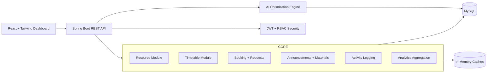

# College Resource Optimization and Management Platform

## 1) System Overview

This platform is a multi-tenant SaaS application for universities and colleges to optimize the usage of:

- Classrooms
- Laboratories
- Faculty schedules
- Equipment and assets
- Shared campus facilities

It supports four role types:

- Super Admin
- College Admin
- Faculty
- Student

The design is optimized for:

- Real-time visibility into resource availability
- AI-assisted scheduling and allocation
- Conflict prevention and workload balancing
- Scalable operation across multiple campuses and departments

## 2) High-Level Architecture

## 3) Backend Module Breakdown

### Auth & Security
- JWT access token issuance
- Role-based access control (`SUPER_ADMIN`, `COLLEGE_ADMIN`, `FACULTY`, `STUDENT`)
- Endpoint-level authorization via Spring Security
- Input validation and safe defaults

### User & Organization
- Tenant, campus, department hierarchy
- User identity and role mapping
- Faculty and student profiles

### Resource Management
- Classroom management with capacity and feature tags
- Laboratory management with feature tags
- Equipment inventory, assignment, and maintenance
- Live resource status (`AVAILABLE`, `IN_USE`, `UNDER_MAINTENANCE`)

### Timetable Management
- Section-course-term modeling
- Time slot definitions
- Timetable entry CRUD and conflict detection
- AI-assisted timetable generation suggestions

### Booking & Requests
- Resource request workflow (submit, review, approve, reject)
- Facility booking lifecycle
- Approval action tracing

### Analytics
- Utilization KPIs
- Faculty workload distribution
- Occupancy trends and heatmaps
- Department-level usage insights

### AI Optimization
- Timetable optimizer
- Resource recommendation engine
- Conflict detection
- Demand prediction
- Natural language resource search (query parser + candidate ranking)

## 4) Frontend Module Breakdown

### Layout
- SaaS-style sidebar navigation
- Top control bar with theme toggle
- Responsive card/grid dashboard

### Views
- Super Admin console (global analytics, campuses, users)
- College Admin operations (resources, timetable, approvals)
- Faculty area (timetable, requests, materials)
- Student portal (timetable, locations, announcements)

### Interactive Components
- Drag-and-drop timetable board
- Recharts analytics widgets
- AI query panel with recommendation cards
- Status badges for room and asset availability

## 5) Scalability & Reliability Notes

- Multi-tenant boundaries are enforced with `tenant_id` on all domain tables
- Read-heavy widgets should rely on pre-aggregated snapshot tables where possible
- AI workloads are currently synchronous in API layer and can be moved to queue workers later
- Auditable actions are stored in activity logs for compliance

## 6) Security Controls

- BCrypt password hashing
- JWT expiration + signature verification
- Role claims in token mapped to Spring authorities
- Input validation for DTOs
- Activity logging for sensitive actions (auth, approvals, resource updates)

## 7) AI Strategy (Initial Version)

- Rule- and score-based optimization to keep behavior deterministic and explainable
- Recommendation scoring dimensions:
  - Capacity fit
  - Feature match
  - Conflict-free availability
  - Utilization balancing
- Demand prediction in v1:
  - Moving average and trend from recent utilization snapshots
  - Stored output in `ai_insights` and `utilization_snapshots`

## 8) Deployment Topology (Suggested)

- `frontend` (React static bundle) served via CDN/reverse proxy
- `backend` Spring Boot API behind load balancer
- `mysql` with automated backups and migration tooling (Flyway/Liquibase in next phase)
- Optional Redis for session blacklists / short-lived caches
